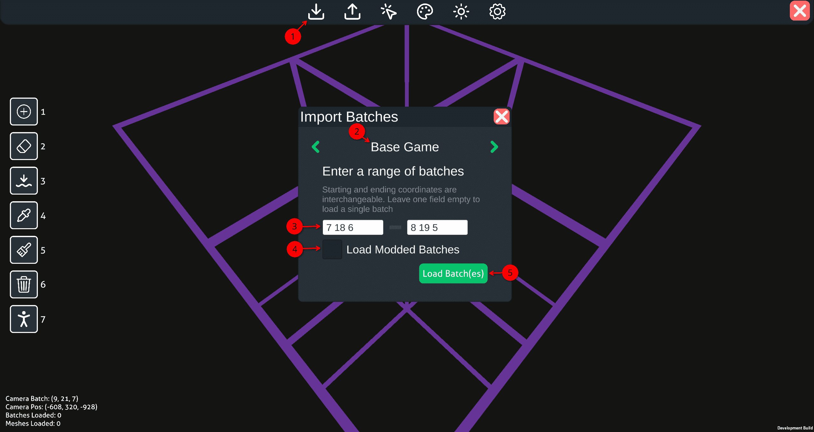
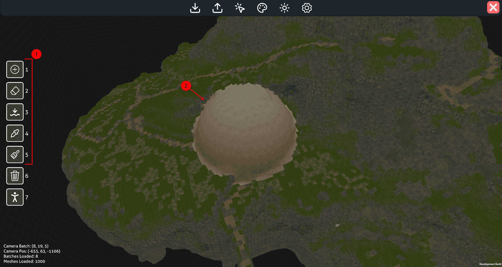
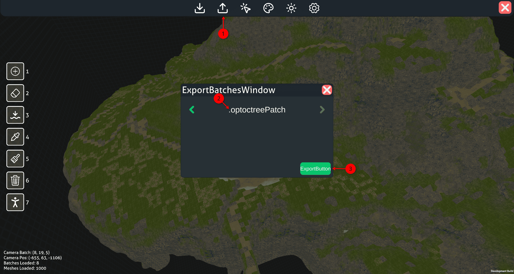
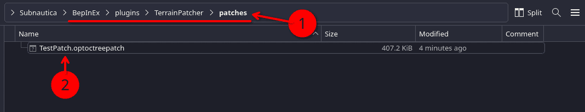
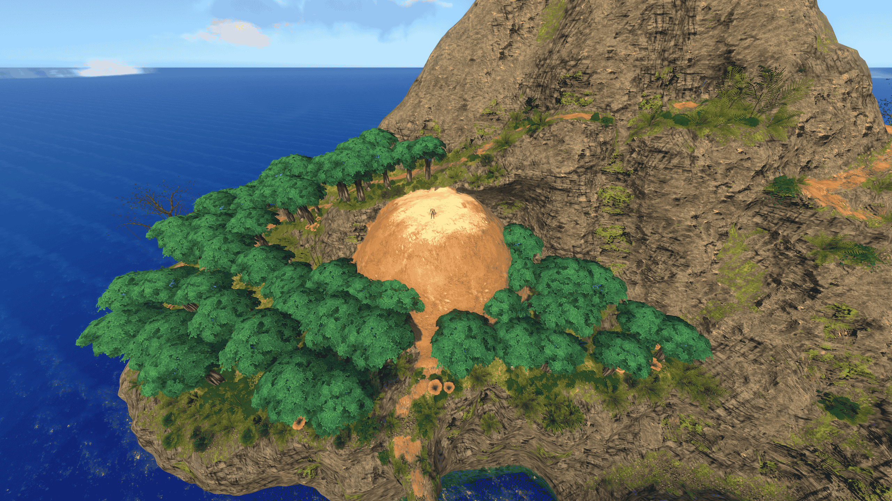

# Beginners Tutorial

This tutorial is intended for people new to modding terrain in Subnautica and using Abyss Editor, taking you from no knowledge to creating your first patch and loading it with TerrainPatcher.

## Prerequisites

1.  This tutorial assumes hat you have a working BepInEx setup installed and working within your Subnautica directory. 
    If you need help with that, ask within the [Subnautica Modding Discord Server](https://discord.gg/UpWuWwq)

2.  This tutorial expects you already have setup your game path [here](GamePathSetup.md) within the editor

3.  If you have not already installed it, [TerrainPatcher](https://github.com/Esper89/Subnautica-TerrainPatcher) is required to load your patches.
    Download the latest TerrainPatcher zip [here](https://github.com/Esper89/Subnautica-TerrainPatcher/releases) from GitHub and extract to it to your BepInEx/Plugins folder within Subnautica.

    If you have [Nautilus](https://github.com/SubnauticaModding/Nautilus#%EF%B8%8F-installation) installed as well, a new mod config option will show up to help confirm Terrain Patcher was installed correctly.

## Working within the editor
    
### Loading your batches

The world of Subnautica is broken up into hundreds of "batches". There are two coordinate system that need to be understood to load exactly what you want properly: batch level coordinates, and world coordinates. 
Each batch within Subnautica has an associated coordinate in (x,y,z) form and spans a 160m x 160m x 160m region. 
World coordinates are used in the position of the player and everything else, these are what you are mostly likely already familiar with.

With this in mind, the batch (0, 0, 0) starts at (-2048, -3040, -2048) world coordinates. This is 3000m deep into the void and not the safe shallows as one might expect.
Batch (12, 18, 12) is the centermost batch and covers the region from (-128, -160, -128) to (32, 0, 32).

??? tip "Tools to make this easier "

    While this is may be complicated to understand, there are tools to inside and outside the game to make this easier:

    - Pressing **F1** when in a save file will open up a debug menu. Under "Camera batch #:" you will see the x,y,z of the batch your player is currently within
    - Opening the in-game console with **Shift+Enter** and using the "batch x y z" command. Typing "batch 12 18 12" will send you to the rough center of batch 12 18 12. This can help you narrow down what you want to load
    - Outside of the game, [this](https://ignis.errorfm.com/subnautica_map/?game=sn) site can show a high level overview of the world, if you check "Toggle batches grid" in the upper right

    For the purposes of this turorial we are going to be using the batches (7, 18, 6) to (8, 19, 5)

1.  Start by opening the import window in the top menu bar
2.  Ensure your import mode is on **Base Game**. By default it should be, but if its not, cycle the left and right arrows.
3.  Type in the batch coordinates **7 18 6** to **8 19 5**, these correspond to the floating islands. Every batch between these two numbers (inclusive) will be loaded. 
    As you type it in, purple grids representing the batches will appear to help guide you.
4.  Ensure **Load Modded Batches** is unselected. This setting, if toggled, pulls from Terrain Patchers cache if enabled. Generally, this toggle should be left off for proper **Base Game** imports
5.  Press the **Load Batch(es)** to begin the import. This may take a moment depending on your hardware.

### Moving the camera around

Camera movement within the editor is as follows:

-   **W S A D**: Forward Backward Left Right
-   **C**: Downwards
-   **Spacebar**: Upwards.
-   **RMB** :material-mouse-right-click-outline:: Activate mouse look
    -   While this button is held, moving your mouse around will move the camera

While this happens, you will see a stats

### Using Brushes

Brushes are the main tools for editing terrain within the editor. They are located on the left side of the screen in a hotbar.

??? tip

    To quickly switch between brushes, the number keys can be used

1.  Select a brush, 1-5 are used for manipulating terrain directly.
2.  Use your cursor and click with **LMB** :material-mouse-left-click-outline:

*[RMB]: Left Mouse Button/Left Click
*[LMB]: Right Mouse Button/Right Click

## Getting your changes into Subnautica

Once you have made your changes to the terrain you have loaded, its time to export them into a format that Terrain Patcher can understand and load into the game

### Exporting a .optoctreepatch

1.  Open the export window in the top menu bar
2.  Ensure your import mode is on **.optoctreePatch**. By default it should be, but if its not, cycle the left and right arrows.
3.  Press the export button
    -   Your file browser will pop up. Give the patch file a name and ensure its extension is *.optoctreepatch*. Remember where this is as we will need to move it into the game in the next steps.

??? note "For larger mods"
    
    If you plan to use this patch in a larger mod with other associated files, Terrain Patcher will search any subdirectory within the BepInEx/Plugins Folder. 
    So for example, if I created a folder within my mod at the path: /BepInEx/Plugins/MyCoolMod/Terrain/ and put my .optoctreePatch in there, Terrain Patcher would find and load it.
    
    This is better practive over telling users to add it to Terrain Patcher's patches folder when working with larger projects.
    
### Using the .optoctreepatch with Terrain Patcher

1.  Within your Subnautica directory, navigate to the directory: /BepInEx -> /plugins -> /TerrainPatcher -> /patches
2.  Move/Paste your .optoctreepatch file into this directory. Terrain patcher will find it and load it the next time you open Subnautica

### TroubleShooting

If you run into any
