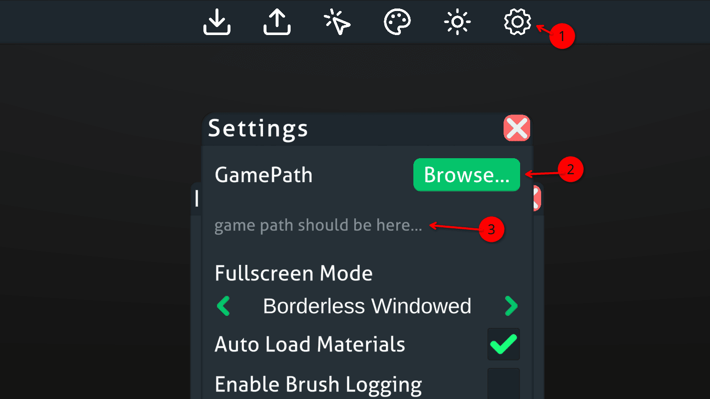
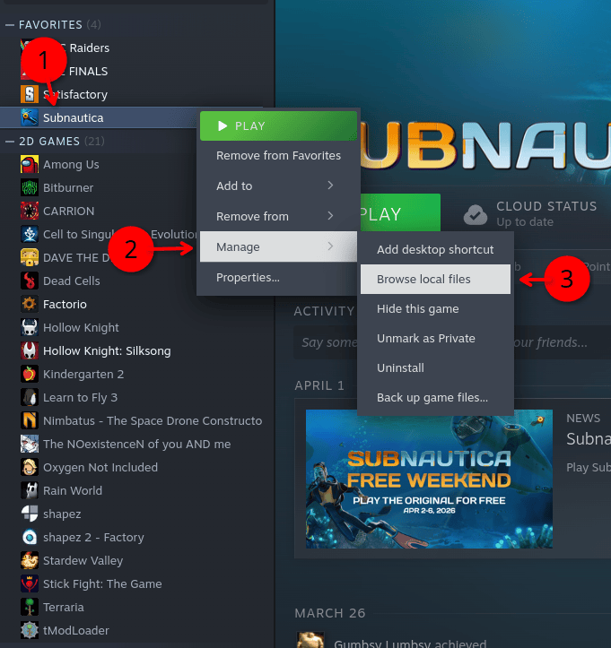
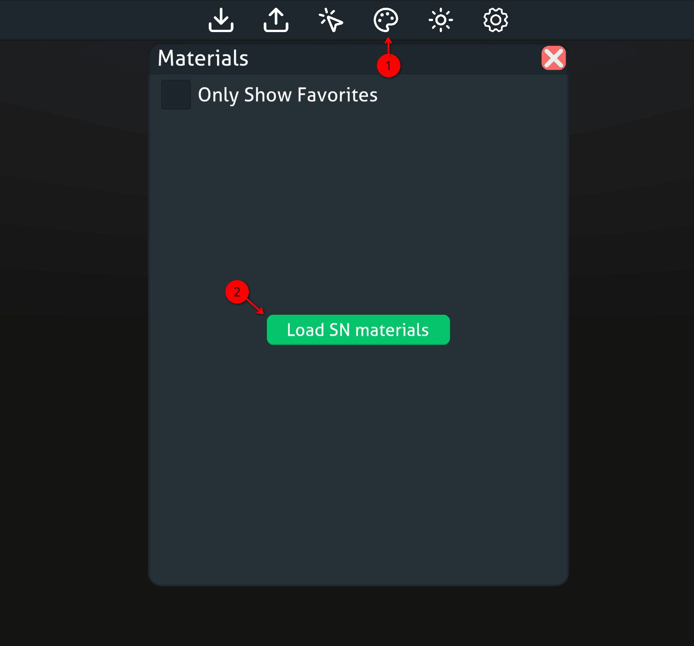

# Game Path Setup

When you open up the editor for the first time, it will show an error explaining that you need to **"Please select a valid game path"**.

1.  First make sure you have the settings window open. It likely is already open, but if isn't, check the top bar.
2.  Press the big green "Browse..." and a file manager will open up. Navigate to your game folder and select the root directory (the one with **Subnautica.exe** or **Subnautica.app**)
3.  If all worked correctly, then you will see your game path here without errors.

??? question "Cant find your game path?"
    
    For steam users, the easiest way is though this method. If you own the game on another platform, look up where its games are stored.
    
    
    
    1.  Right click your game in the left menu.
    2.  Go to **Manage**
    3.  then **Browse local files**
    4.  Make note of this location and use it when the editor asks you to browse for the game directory

!!! warning "Materials will not be loaded *initially*"
    
    When selecting a path for the first time, materials do not autoload like they will in subsequent sessions
    
    
    
    1.  Go to the materials tab
    2.  Select Load SN materials
    
    If you get no errors, then the editor is fully setup!
